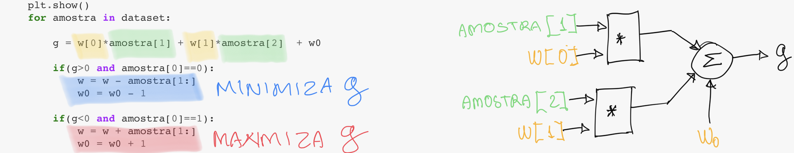

 

I'm on [Twitter](https://twitter.com/abcborges), check out projects at [GitHub](https://github.com/andrecavalcante).

## News and projects

### [A minimum implementation of importance weighted autoencoder (IWAE) in Pytorch](https://github.com/andrecavalcante/iwae)

  

### [Application of intepretability for lawsuit prediction in the energy sector: a talk at IWSSIP 2020](https://underline.io/lecture/2836-interpretability-of-machine-learning-models-application-for-lawsuit-prediction-in-the-energy-sector)

### [Demonstração jupyter da máquina Perceptron](https://github.com/andrecavalcante/TEEE-aprendizado-de-maquina/blob/master/perceptron.ipynb)
  

      

### [Aprendizado de máquina e o problema de classificação (sem matemática)](https://medium.com/@andrecavalcante/aprendizado-de-máquina-parte-2-classificação-2e6d2045407)

  

### [Prostate segmentation in magnetic resonance](https://andrecavalcante.github.io/prostate_segmentation)

