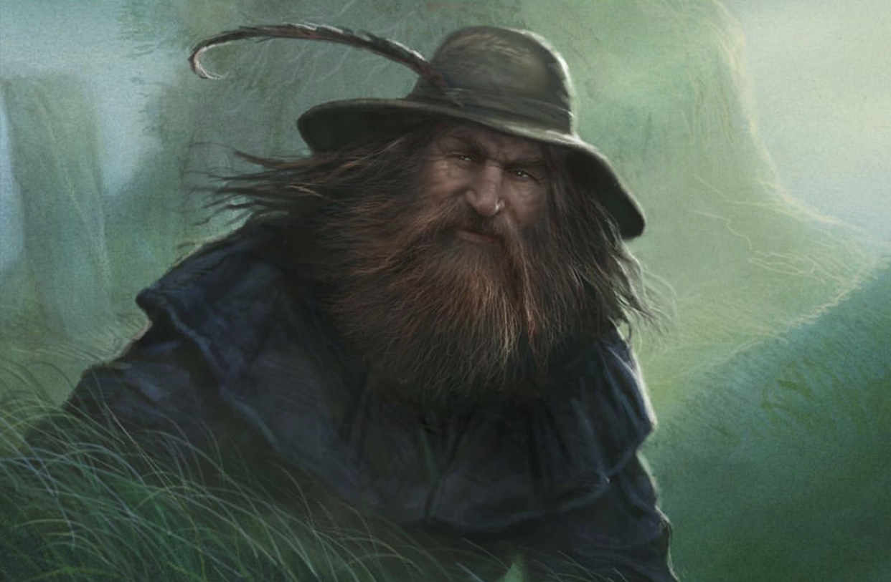
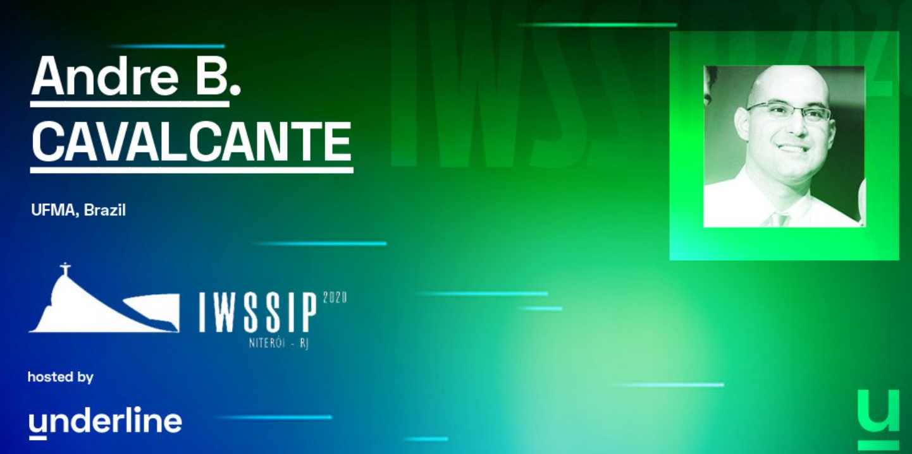
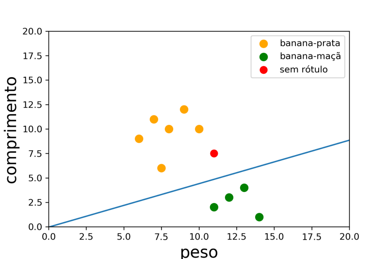
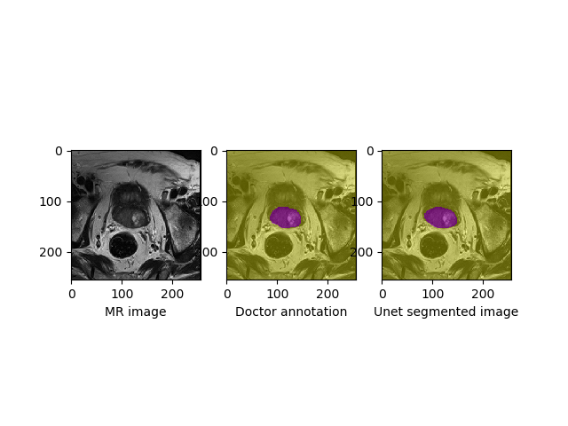

 



I'm on [Twitter](https://twitter.com/abcborges), check out projects at [GitHub](https://github.com/andrecavalcante).

## News and projects

### [Application of intepretability for lawsuit prediction in the energy sector: a talk at IWSSIP 2020](https://underline.io/lecture/2836-interpretability-of-machine-learning-models-application-for-lawsuit-prediction-in-the-energy-sector)

<a href="https://underline.io/lecture/2836-interpretability-of-machine-learning-models-application-for-lawsuit-prediction-in-the-energy-sector">

</a>  

### [Demonstração da máquina Perceptron](https://github.com/andrecavalcante/TEEE-aprendizado-de-maquina/blob/master/perceptron.ipynb)
```bash
 for amostra in dataset:
        g = w[0]*amostra[1] + w[1]*amostra[2]  + w0  # função discriminante
        if(g>0 and amostra[0]==0): 
            w = w - amostra[1:]  # maximiza g
            w0 = w0 - 1
        if(g<0 and amostra[0]==1):
            w = w + amostra[1:] # minimiza g
            w0 = w0 + 1
```
      

### [Aprendizado de máquina e o problema de classificação (sem matemática)](https://medium.com/@andrecavalcante/aprendizado-de-máquina-parte-2-classificação-2e6d2045407)

<a href="https://medium.com/@andrecavalcante/aprendizado-de-máquina-parte-2-classificação-2e6d2045407">

</a>  

### [Prostate segmentation in magnetic resonance](https://andrecavalcante.github.io/prostate_segmentation)


<a href="https://andrecavalcante.github.io/prostate_segmentation">

</a>
